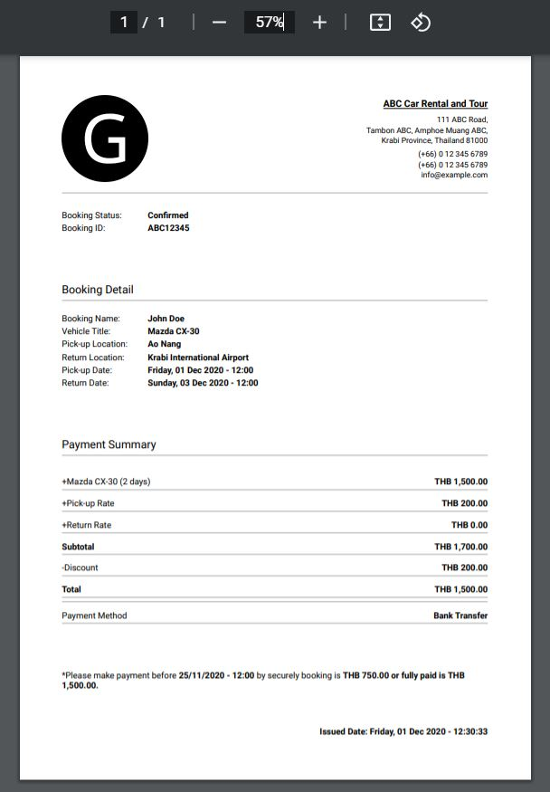

# Generate receipt example by PDFkit

<center>
  <div >
    
  </div>
</center>

## start project

```js
npm install -g yarn
```

```js
yarn install
```

```js
yarn start
```

Generate PDF for example: `http://localhost:3000/pdf/create-receipt`
